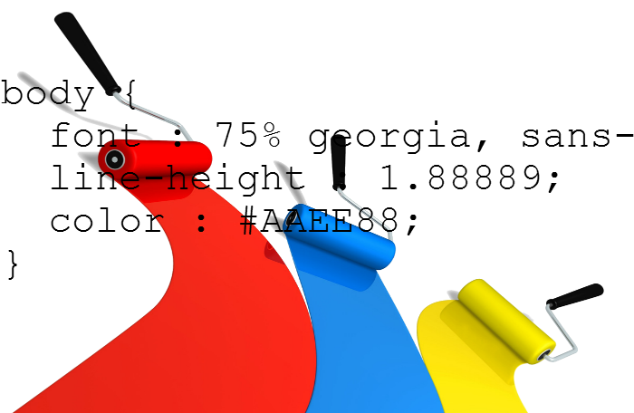
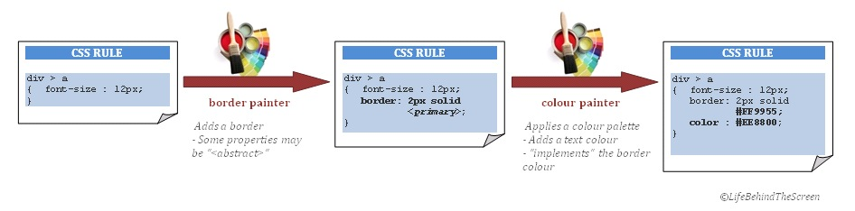

# css_theme_generator

## Generating themed css stylesheets with Java

### Abstract

CSS is too low level when you want to think the look and feel of your website in terms of "theme".
A **theme** would be a coherent set of CSS settings that "go well together". For example, mixing all sorts of fonts or using non-complementary colours are examples of things that don't "go well together". Problem is, there's nothing to prevent you doing that in CSS. 

The aim of this project is to show how it is possible to build upon CSS and offer a higher level, more coherent approach to theming a webpage.

By defining the concept of "*Painters*", then stacking them up and combining them to form a the idea of "*themes*", 
we are presented with a powerful tool that achieves just that, and relegates CSS to generated machine code.

The code presented here is written in Java, but it could have been written in any other (Turing complete ;o)) language.



### Intro

CSS has come a long way over the years but if you're trying to build anything more than a static page you'll still find it suffers many shortcomings.

For example, there are no variables. If you're using one same colour in multiple rules, and wish to change it, you will have to edit all the rules, you can't use a variable and just change its value.

Many tools have arisen to bridge these shortcomings. A simple web search will yield many references (look for "css framework"). A few examples among many: less, sass.

These tools are often a superset of CSS, providing the basic programmatic mechanisms that CSS lacks: variables, functions, inheritance etc.

However these tools come short when we start to think of styling in terms of "theming". A theme would be a set of visually coherent styling properties applied to content (either by the website programmer, or by the browsing user if the site is very dynamic). For example, a "liquid" theme could display rounded box edges, fancy fonts, and lively colours, whereas a "square" theme could exhibit square edges, straight fonts and darker shades. To achieve that we need to have some mechanism to abstract display properties and bundle together sets of coherent, intertwined and inter-dependant CSS properties.

In this article, we'll describe such a mechanism. The language chosen is Java, and the code is meant to be executed server-side, but the concept can easily be ported to PHP, Python or Javascript, and be executed client-side.


### Approach

What we're trying to achieve follows: 
-generate css stylesheet on the fly
-stylesheet reflects a chosen "theme"
-easily develop new themes based on existing


The concept of themes is not something that would let us think we're exploring uncharted territory. Themes are for example quite widespread in desktop software (they're usually called skins). However desktop application programming and web development are quite different.

So it seems we'll have to build our solution from the bottom up. Or rather, use another analogy. The power in analogies lies in the leverage they bring from solutions that have already been thought trough and tested in other domains - provided that transposing is possible.

In our case we'll get our inspiration from image editing tools. Image editing tools illustrate the concept of working "by layers". Here we mean not the specific editing software lingo, but layers in the broad sense, i.e. changes that are applied successively to a picture and pile up (or down when you hit "undo"). You start with a blank canvas, then apply a background. Then apply a border. Then some content etc. Then choose a colour tone, that might affect the background colour, the border colour and possibly other layers already laid.


We'll try and replicate this concept. This will help us build the tools to work in semantical terms of higher level than the too finely-grained CSS properties. 

So following of our analogy, our canvas will be a css rule (for example div > a.special), on which we will apply changes (layers) one after the other. We'll name the tool to apply these layers "painters".

The following diagram gives an idea of the core mechanism:



### Modelling the CSS rule and stylesheet

First let's start by modelling a CSS rule: <code>CssRule</code> is a class listing of properties with their values, just like "real-life" CSS. 
The class lets us add a property with its value or remove it.
The class also manages CSS pseudo classes and their priority (LoVeHAte).
This is the class the *Painters* will operate on (they will change/add properties and values)
Once the painters have been applied, the rule can be printed (for output in a css file).

(notice: in this document code snippets have been stripped of material not directly relevant to the  subject. See files for full code) 

```java
/**
 * Represents a css rule, i.e.:                 <br />
 * - a rule name (aka selector name)            <br />
 * - a list of css properties and their values  <br />
 * Example                                      <br />
 * <pre>
 * .class
 * {	border : 1px solid red;
 *  	padding: 2px;
 * }
 * </pre>
 *
 *
 * @author francois hill
 * @since 28 nov. 2012
 */
public class CssRule
{
	/**
	 * Defines a couple {property, value}
	 *
	 */
	private class CssProperty
	{	public String property;
		public String value   ;
		public CssProperty(String prop, String val)
		{	property = prop;
			value    = val;
		}
	}

	private String            selectorName   = null;

	private List<CssProperty> cssProperties  = new ArrayList<CssProperty>();

	/**
	 * Here we're using a LinkedHashMap to keep the order of insertion of the pseudoclass. This order is important in css.
	 */
	private Map<String, List<CssProperty>> cssPropertiesPseudo = new LinkedHashMap<String, List<CssProperty>>();


	...


	/**
	 * Add a css property (with its value) to this rule, overwriting, or not,
	 * any previous value set for that property.                                                    <br />
	 * If the value is <tt>null</tt>, it won't be added.                                            <br />
	 * @param prop
	 * @param val
	 * @param remove   remove any property of same name before inserting (i.e. overwrite).
	 *                 If <tt>false</tt>, the property will just be added, resulting in a rule
	 *                 that may have several values defined for the same property (i.e. several
	 *                 couples <tt><prop, val></tt> with <tt>prop</tt> being identical)
	 */
	public void set(boolean remove, String prop, String val)
	{
		if(val != null)
		{	// Remove before add:
			if (remove) {remove(null, prop);}
			cssProperties.add(new CssProperty(prop, val));
		}
	}


	/**
	 * Add a css property (with its value) to this rule or to a pseudo class of this rule, overwriting
	 * any previous value set for that property.                                                    <br />
	 * Alias for <tt>set(pseudoClass, prop, val, true);</tt>                                        <br />
	 * If the value is <tt>null</tt>, it won't be added.                                            <br />
	 * @see {@link #set(String, boolean, String, String)}
	 * @param prop
	 * @param val
	 */
	public void set(String pseudoClass, String prop, String val)
	{	set(pseudoClass, true, prop, val);
	}


	/**
	 * Add a css property (with its value) to this rule or to a pseudo class of this rule, overwriting, or not,
	 * any previous value set for that property.                                                    <br />
	 * If the value is <tt>null</tt>, it won't be added.                                            <br />
	 *                                                                                              <br />
	 * DESIGN NOTE: although optional, pseudoClass is placed as the first parameter, this is
	 * done to uniformise the look of the many calls to this function with varying <tt>prop</tt> and <tt>val</tt>
	 * but always the same pseudoClass.                                                             <br />
	 * Same for <tt>remove</tt>.
	 *
	 * @param pseudoClass optional (pass null if non applicable).
	 *                    Ex: "active", "hover", "focus", "link"...
	 *                    If passed null, this is equivalent to calling
	 *                    {@link #set(String, String)}
	 * @param prop
	 * @param val
	 * @param remove      remove any property of same name before inserting ?
	 */
	public void set(String pseudoClass, boolean remove, String prop, String val)
	{
		if(val != null)
		{
			if (pseudoClass == null)
			{	set(remove, prop, val);
			}
			else
			{
				if (! cssPropertiesPseudo.containsKey(pseudoClass) || cssPropertiesPseudo.get(pseudoClass) == null)
				{	 cssPropertiesPseudo.put(pseudoClass, new ArrayList<CssProperty>());
				}

				// Remove before add:
				if (remove) {remove(pseudoClass, prop);}
				cssPropertiesPseudo.get(pseudoClass).add(new CssProperty(prop, val));
			}
		}

	}


	/**
	 * Remove a given property from the rule
	 * @see {@link #set(String, String, String)}
	 * @param pseudoClass same as in {@link #set(String, String, String)}
	 * @param prop property to be removed
	 */
	public void remove(String pseudoClass, String prop)
	{
		if (pseudoClass == null)
		{	removeProp(cssProperties, prop);
		}
		else
		{
			if (cssPropertiesPseudo.containsKey(pseudoClass))
			{	removeProp(cssPropertiesPseudo.get(pseudoClass), prop);
			}
		}
	}


	private void removeProp( List<CssProperty> list, String prop)
	{
		...
	}


	/**
	 * 
	 * @param sel_name selector name
	 */
	public CssRule(String sel_name)
	{	selectorName = sel_name;
	}


	/**
	 * Print out the css rule.
	 * @return
	 */
	public String print()
	{	StringBuffer sb = new StringBuffer();

		// 1.Print regular rule
		// ---------------------
		// 1.1 Print regular rule name

		if(selectorName != null)
		{	sb.append(selectorName + "\n{");
		}

		// 1.2 Print regular rule properties
		for (CssProperty cssProp : cssProperties)
		{	sb.append("\t");
			sb.append(cssProp.property);sb.append(" : "); sb.append(cssProp.value);sb.append(" ;");
			sb.append("\n");
		}

		if(selectorName != null)
		{	sb.append("\n}\n");
		}

		// 2.Print pseudoclasses rules
		// ----------------------------
		// 2.1 Re-order pseudoclasses

		// The key set is ordered in the insertion order so it is up to the theme to insert the pseudoclasses in the right order.
		// However we'll still operate a reorder to catch any possible order mistakes:
		Set<String> pseudoClasses = cssPropertiesPseudo.keySet();
		Set<String> pseudoClassesSorted = new LinkedHashSet<String>();
		if (pseudoClasses.contains("link"   )) { pseudoClassesSorted.add("link"   );}
		if (pseudoClasses.contains("visited")) { pseudoClassesSorted.add("visited");}
		if (pseudoClasses.contains("hover"  )) { pseudoClassesSorted.add("hover"  );}
		if (pseudoClasses.contains("focus"  )) { pseudoClassesSorted.add("focus"  );}
		if (pseudoClasses.contains("active" )) { pseudoClassesSorted.add("active" );}
		for (String pseudo : pseudoClasses)
		{	if (   (! "link"   .equals(pseudo))
			    && (! "visited".equals(pseudo))
			    && (! "hover"  .equals(pseudo))
			    && (! "focus"  .equals(pseudo))
			    && (! "active" .equals(pseudo))
			   )
			{	pseudoClassesSorted.add(pseudo);
			}
		}

		// 2.2 Print pseudoclasses rules
		for (String pseudo : pseudoClassesSorted)
		{
			if(selectorName != null)
			{
				String[] selectors = selectorName.split(",");                                                 // ex of a selector name : ".myClass, #myId>.myClass"
				for (int i = 0; i < selectors.length; i++)                                                    // trim the array
				{	selectors[i] = selectors[i].trim();
				}
				String new_selectorName = StringUtils.join(selectors, ":" + pseudo +", ") + ":" + pseudo ;    // add the pseudo selector to each separated by ","
				sb.append(new_selectorName + "\n{");
			}
			for (CssProperty cssProp : cssPropertiesPseudo.get(pseudo))
			{	sb.append("\t");

				sb.append(cssProp.property);sb.append(" : "); sb.append(cssProp.value);sb.append(" ;");
				sb.append("\n");
			}
			if(selectorName != null)
			{	sb.append("\n}\n");
			}
		}

		return sb.toString();
	}

}
```

## Painters

### Painter interface

Following our approach we'll start by defining a Painter interface:

```java
public interface IPainter extends Cloneable
{
	/**
	 * Apply this painter on a page element (i.e. on its css rule)
	 *
	 */
	public CssRule apply(CssRule rule);

	/**
	 * Update this painter to take in modifications due to the passed painter.
	 * Used when painters are stacked in a {@link PainterStack}: a painter added on
	 * top of the stack can update all the painters beneath it, i.e. have a side effect
	 * e.g. applying color.
	 *
	 * @param  p
	 * @return indicate whether the updater painter can be removed from the painterStack
	 *         once the update is done. This can be useful for cases where the updating
	 *         painter is just a complement to a specific painter in the stack, and once
	 *         this painter has been updated there is no more justification for the top
	 *         stack painter anymore.
	 *         Note for extending classes: unless you know exactly what you're doing,
	 *         you should return <tt>false</tt>
	 */
	public boolean update(IPainter p);

	public PainterStack add(IPainter p);

	public IPainter clone();
}
```


A Painter, through its apply()  function, takes a css rule in entry, blank or not, and yields a new css rule reflecting the changes brought by the painter.


For example, consider the following css rule:
```css
.div > a.special 
{	color : #EE88EE;
}
```
going through a Painter that "paints" a black border.
The resulting css rule would be:
```css
.div > a.special 
{	color : #EE88EE;
	border : 2px solid black;
}
```

### Parent Painter class

Implementing the interface, here is the (abstract) painter parent to all concrete painters we're going to create later on:
```java
public abstract class Painter implements IPainter
{
	public CssRule apply(CssRule rule)
	{
		return apply(rule, null);
	}


	@Override
	public Painter clone()
	{	/*        */	try
		/*        */	{

		return (Painter) super.clone();

		/*        */	}
		/*        */	catch (CloneNotSupportedException e1)
		/*        */	{	throw new RuntimeException("This should not happen. Check code.", e1);
		/*        */	}
	}


	public PainterStack add(IPainter p)
	{	return new PainterStack().add(this).add(p);
	}

	
	@Override
	public String toString()
	{
		return "Painter = [" + this.getClass().getSimpleName() + "]";
	}
	
}
```

### Examples of painters

#### A straightforward painter: the Border Painter
```java
public class PainterBorder extends Painter
{
	private String             style             = null;
	private String             width             = null;
	private ETypeColorSet      colorSet          = null;
	private ETypeColorShade    shade             = null;
	private String             color             = null;

	private Palette            palette           = null;

	/**
	 * Builder pattern, adapted. Offers an alternate way of building a PainterBorder.   <br />
	 * @see PainterBackground.Builder
	 */
	public static class Builder
	{	PainterBorder pb;

		/**
		 * Build a new PainterBorder 'from scratch'.
		 * @see Builder
		 */
		public Builder()
		{	pb = new PainterBorder();
		}

		/**
		 * Build a new PainterBorder on the basis of the passed PainterBorder.
		 * @see Builder
		 */
		public Builder(PainterBorder p)
		{	pb = (PainterBorder) p.clone();
		}

		/**
		 * Set css 'style' property. Ex: "solid", "dotted"
		 */
		public Builder style            (String            style             )    {pb.style             = style                                      ; return this; }

		/**
		 * Set css 'width' property. Ex: "0px"   "1px 2px 0px 3px"
		 */
		public Builder width            (String            width             )    {pb.width             = width                                      ; return this; }

		/**
		 * Applies an empty border (i.e. no border).
		 * Same as <tt>width("0px")</tt>
		 */
		public Builder none            ()                                         {pb.width             = "0px"                                      ; return this; }

		/**
		 * Border color, specified directly (ex: "#FFFFFF").
		 * The other way to specify the color is to specify or both <tt>colorSet</tt> and <tt>shade</tt>.
		 */
		public Builder color            (String            color             )    {pb.color             = color                                     ; return this; }

		/**
		 * ColorSet from which to pick border color.
		 */
		public Builder colorSet         (ETypeColorSet     colorSet          )    {pb.colorSet          = colorSet                                  ; return this; }

		/**
		 * Shade of the colorSet to pick as border color.
		 */
		public Builder shade            (ETypeColorShade   shade             )    {pb.shade             = shade                                     ; return this; }

		/**
		 * Finalize building and return the built PainterBorder.
		 */
		public PainterBorder build()
		{	return pb;
		}
	}


	/**
	 * @used_by {@link PainterBorder.Builder}
	 */
	protected PainterBorder() {}


	public boolean update(IPainter updater)
	{	...
	}


	public CssRule apply(CssRule element, String pseudoClass)
	{
		if (colorSet != null && shade != null && palette != null)
		{	color = palette.getColorSet(colorSet).getShade(shade).printHex();
		}

		element.set(pseudoClass, "border-width", width);
		element.set(pseudoClass, "border-style", style);
		element.set(pseudoClass, "border-color", color);
		return element;
	}

...
}
```
A few interesting things to notice:

•	We're implementing a modified version of the Builder pattern (see Bloch, Effective Java, item XX). This pattern is especially useful when dealing with an object with many default and settable properties. 
o	This allows us to create a BorderPainter in a chained fashion, as follows:
```java
new PainterBorder.Builder().width("1px 1px 1px 1px").style("solid").build();
```
o	Painters are immutable. This greatly contributes to reducing mistakes and bugs of all sorts when using painters.

•	You might notice the presence of a few classes when it comes to colour properties and values: ETypeColorSet      , ETypeColorShade. These enum classes are used to describe the colour shades of a Colour Palette object we'll be using to globally manage the colours in our generated CSS rules. 

We'll explore the concept in depth later on. For the moment, all we need to know is that a Colour Palette lets us abstract the actual colour from the rule we're painting. Instead of writing "#E8AA32", we'll specify "shade 3 (of 5) of the secondary (or primary, or ternary etc.) colour". Once we've finished building our rule, if we need to print it out we'll apply a last Painter, PainterColor , that will replace all the references to the colour palette by the actual colour codes.

In short, the colour palette mechanism allows us to:
•	easily change the colours of our CSS rules 
•	work within a set of coherent tones. This is paramount in our quest of producing stylesheets with the underlying idea of themes. Themes have colour schemes.

•	You might find the border painter to be quite "collinear" with the CSS border properties, in the sense that it does not decouple the build functions that it offers from the underlying CSS properties much. However, other painters may display more "orthogonality", offering build functions with a higher cognitive level, cross-cutting several CSS properties. Next section offers examples. 


WIP, soon to come!
